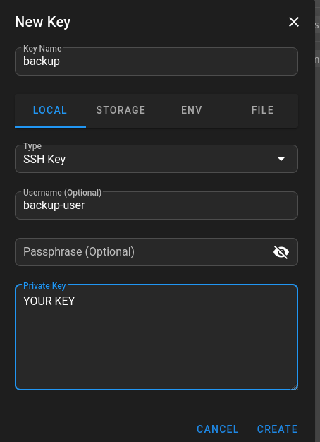
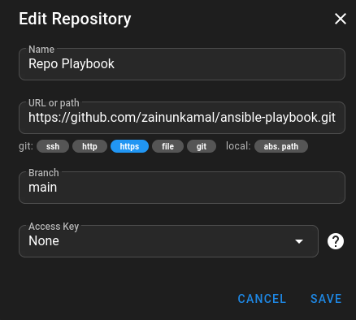
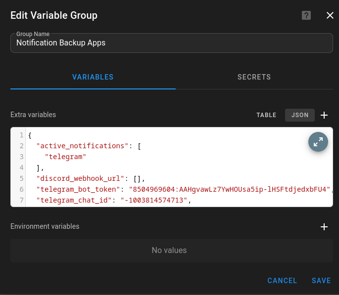
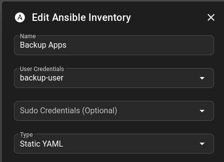
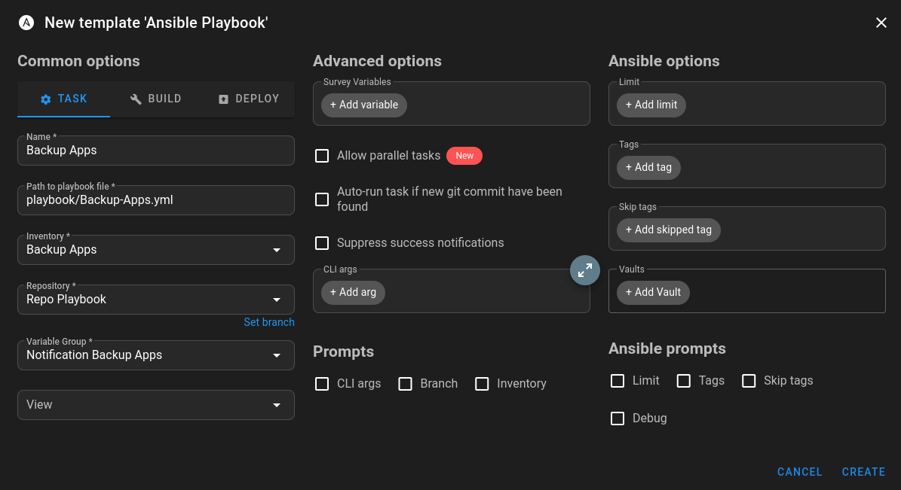

# 📘 Application Backup Guide (Web/Apps)

The primary file for this execution is **`playbook/Backup-Apps.yml`**. This playbook ensures that all Application *Source Code* on the App Server is securely distributed to the *Backup Server*, without localized failure interruptions.

## ⚡ Workflow
In its new schema, the playbook operates using a *High-Performance Async* system:
1. **Auto-Discovery**: Automatically scans application directories defined in `base_web_dir`, merges them with manually defined target applications, and skips the directories specified in `ignored_folders`.
2. **Parallel Rsync**: The playbook calculates the application configurations and asynchronously triggers the `rsync` execution (simultaneously parallel) into the background. Progress checks are stabilized at 1-minute intervals (to prevent `FAILED - RETRYING` spam logs).
3. **Size Checking**: The playbook queries the directory *size* on the target (Backup Server) before and after the *Rsync*.
4. **Daily & Monthly Tar Compression**: Compresses the target HTML source codes into `.tar.gz` bundles. This is executed daily, as well as an exclusive rotation every 1st of the month using the same parallel execution method.
5. **Scheduled Cleanup**: Scans and deletes expired archival histories (`find -mtime`).
6. **Partial Report & Notification**: Initializes an *individual report array*, sorts out successful applications, calculates capacity differences, and tags failed applications without halting the rotation map for other applications on the list. The report is delivered neatly to Discord/Telegram/WhatsApp.

---
## ⚙️ Ansible Server / Semaphore Server
### *SEMPAHORE*
In the semaphore UI, we will need ssh-key to access the application server. You need generate key frist then you can add the ssh-key in the semaphore UI.



### *ANSIBLE*
If you use ansible, you can generate SSH Keygen
```bash
ssh-keygen -t ed25519 -N "" -f ~/.ssh/id_ed25519
```

## ⚙️ Base Server Preparation (App Server)

You must configure account permission settings on the initial target server so that the Ansible Semaphore bot can act securely and automatically (`passwordless`).

Run the following sequences using `root` or `sudo` access on the application server:

**1. Create a dedicated sync user**
```bash
sudo useradd --system --create-home --user-group --shell /bin/bash backup-user
```

**2. Install *Access Control List (ACL)* Management**
```bash
sudo apt update
sudo apt install acl -y
```

**3. Bypass Read Limitation (*Set ACL for application directories*)**
This function allows the *backup-user* user to read and execute the source folders without being able to write or corrupt them.
```bash
sudo setfacl -R -m u:backup-user:rx /var/www/html/
```

**4. Generate Access Keys (SSH Passwordless to the Backup server)**
```bash
sudo su - backup-user
ssh-keygen -t ed25519 -N "" -f ~/.ssh/id_ed25519
# Send the public key to Backup Server (Make sure SSH ports are matched if non-standard)
ssh-copy-id  -p <PORT_SSH> -i ~/.ssh/id_ed25519.pub <USER_BACKUP>@<IP_TARGET_BACKUP>
```
*If the backup server not using password, you can put manually PUB_KEY to the backup server*

**5. Authorize Ansible / Semaphore**
So that Ansible can remote/login into server apps, you must place the Ansible / Semaphore Server's *SSH Public Key* into the trusted list.
```bash
cat << 'EOF' >> ~/.ssh/authorized_keys
# Place your Ansible / Semaphore Pubkey below this line:
ssh-ed25519 AAAA... 
EOF

# Lock the permissions
chmod 600 ~/.ssh/authorized_keys
```

*(Perform the above integrations across all new App Servers you register in the Inventory).*

## ⚙️ Repository, Inventory and Variable Configuration (SEMAPHORE)
### Repository
We create new Repository on SEMAPHORE
1. Name -> You can give a name for the repository
2. URL -> You can choose the url which you created
3. Branch -> You can choose the branch which you created



### Variable Group
Variable for notification apps. You can choose one or more *discord, telegram, whatsapp*


```json
{
  "active_notifications": [
    "discord"
  ],

  "discord_webhook_url": [],
  "telegram_bot_token": [],
  "telegram_chat_id": [],
  "whatsapp_api_url": [],
  "whatsapp_api_key": [],
  "whatsapp_target_number": []
}
```
### Inventory
We create new Inventory on SEMAPHORE
1. Name -> Just a name for inventory
2. User Credentials -> We using the user from keystore which we created
3. Type -> We using Static YAML



```yaml
all:
  children:
    app_servers:
      # THIS IS GLOBAL VARIABLE
      vars:
        backup_ip: "x.x.x.x"          # IP Server Backup
        backup_user: "USER_BACKUP"    # User backup
        backup_port: "22"             # Port SSH Server Backup
        daily_retention_days: "7"     # Retentoin of daily (ex 1 week = 7)
        monthly_retention_days: "365" # Retention of monthly (ex 1 year = 365)
        auto_discovery: true          # (true | false, you can set autodiscovery of apps)
        base_web_dir: "/var/www/html" # Folder which for autodiscovery
        ignored_folders:              # Folder which we ignore for backup
          - "phpmyadmin"
          - "logs"
          - "lost+found"
        default_auto_excludes:        # Folder which is exclude
          - "logs"
          - "sessions"
          - "tmp"

      hosts:
        <IP_ADDRESS_APPS1>:
          # Port SSH
          ansible_port: 22 
          # [Target Identifiers]
          server_alias: "Web Application Farm"
          backup_path: "/data/backup" # Root Backup Target Directory
          
          # [App Manifest] List apps processed on this specific node
          apps:
            - name: "NAME_APPS1"
              src: "/var/www/html/apps1"
              exclude: [".env", "storage/logs"] # Prevent junk data sync
            - name: "NAME_APPS2"
              src: "/var/www/html/apps2"
              exclude: [] # Prevent junk data sync
```
*🔍 Auto-Discovery Feature*
The playbook supports Hybrid Auto-Discovery for applications to easily scale backups. Here is how it works:
- **`auto_discovery: true`**: When activated, the playbook naturally scans `base_web_dir` for existing application folders and merges them to the backup list automatically.
- **`base_web_dir`**: The root path to search for applications (e.g., `/var/www/html`).
- **`ignored_folders`**: Array of directories to be completely excluded from auto-discovery (e.g., `phpmyadmin`, `logs`, `lost+found`).

You can still use the manual `apps` list dictionary within your inventory simultaneously to customize and explicitly define specific `exclude` paths for particular apps.

## ⚙️ Create Task Template

1. Name -> You can give a name for the task
2. Path to Playbook Files -> You can choose the path to the playbook
3. Inventory -> You can choose the inventory which you created
4. Repository -> You can choose the repository which you created
5. Variable Group -> You can choose the variable group which you created



⬅️ *[Back to Main Page](README.md)*
